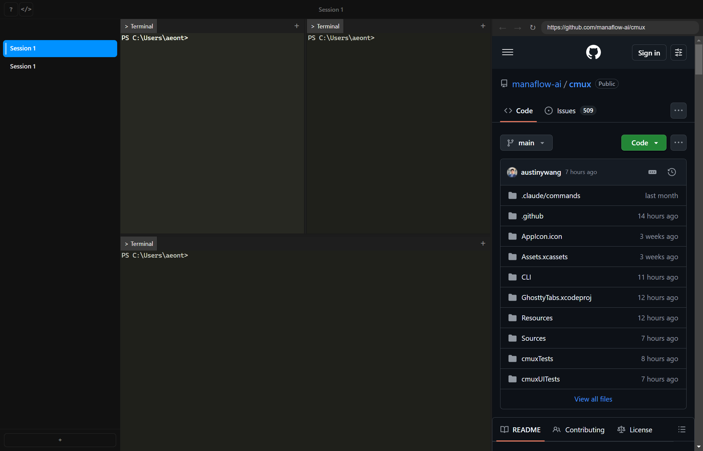
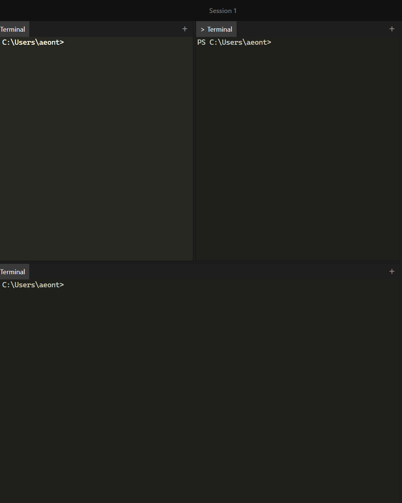
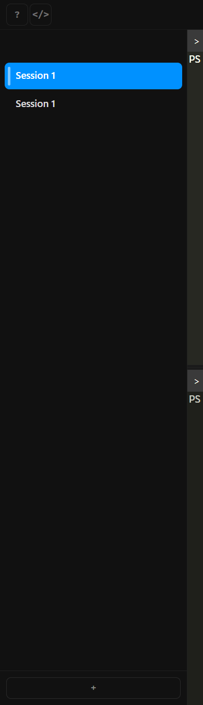
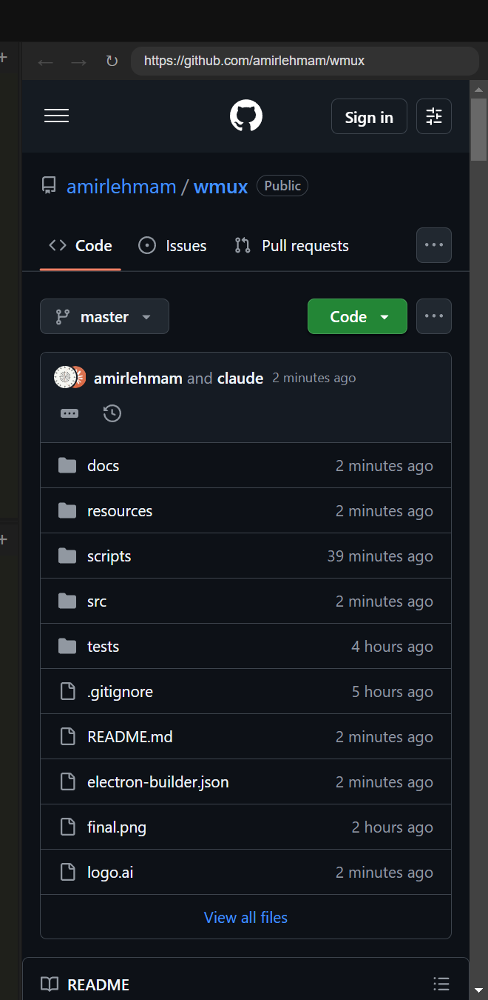
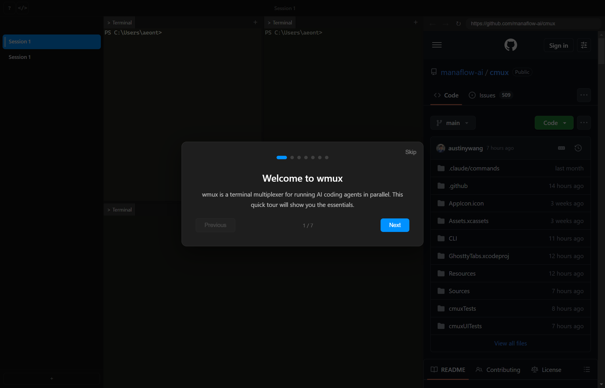

<p align="center">
  
</p>
<h1 align="center">wmux</h1>
<p align="center">A Windows terminal multiplexer with vertical tabs, notification center, scriptable browser, and sub-agent spawning for AI coding agents</p>

<p align="center">
  Built on Electron + xterm.js. Inspired by <a href="https://github.com/manaflow-ai/cmux">cmux</a>. 
</p>

<p align="center">
  <a href="https://github.com/amirlehmam/wmux"></a>
  <a href="https://github.com/amirlehmam/wmux/releases"></a>
  <a href="https://github.com/amirlehmam/wmux/blob/master/LICENSE"></a>
</p>

<p align="center">
  
</p>

## Features

<table>
<tr>
<td width="40%" valign="middle">
<h3>Notification rings + Notification center</h3>
Panes get a blue ring and tabs light up when coding agents need your attention. Supports OSC 9/99/777, <code>wmux notify</code> CLI, and idle detection. Click the bell icon in the title bar to see all pending notifications in one place -- jump to the most recent unread with one click or <code>Ctrl+Alt+N</code>.
</td>
<td width="60%">

</td>
</tr>
<tr>
<td width="40%" valign="middle">
<h3>Vertical + horizontal tabs</h3>
See all your sessions at a glance in a sidebar. Git branch, PR status, working directory, listening ports, shell state indicator, running agent count, and notification text. Double-click to rename. Right-click for colors and workspace management. Split horizontally and vertically.
</td>
<td width="60%">

</td>
</tr>
<tr>
<td width="40%" valign="middle">
<h3>In-app browser with scriptable API</h3>
Split a browser alongside your terminals. CDP-powered scriptable API lets AI agents navigate, snapshot the accessibility tree (<code>@e1</code>, <code>@e2</code> refs), click elements, type text, fill forms, take screenshots, and evaluate JS -- all through the pipe API. Ported from <a href="https://github.com/vercel-labs/agent-browser">agent-browser</a>.
</td>
<td width="60%">

</td>
</tr>
<tr>
<td width="40%" valign="middle">
<h3>Sub-agent terminal spawning</h3>
When Claude Code spawns sub-agents, each gets its own visible terminal. Agents call <code>wmux agent spawn</code> or <code>agent spawn-batch</code> and wmux distributes them across existing panes with round-robin load balancing. 3 panes, 6 agents = 2 per pane. Agent tabs show a distinct blue icon and label so you always know which terminal belongs to which agent.
</td>
<td width="60%">

</td>
</tr>
<tr>
<td width="40%" valign="middle">
<h3>First-launch tutorial</h3>
Interactive onboarding walks you through workspaces, splits, tabs, browser, and notifications. Reopen anytime from the <code>?</code> button in the title bar.
</td>
<td width="60%">

</td>
</tr>
</table>

- **Scriptable** -- Named pipe server (`\\.\pipe\wmux`) with a JSON-RPC API. Create workspaces, split panes, send keystrokes, read terminal content, control the browser via CDP, and spawn sub-agent terminals programmatically.
- **Windows native** -- ConPTY for proper terminal emulation, Windows toast notifications, taskbar flash on alerts, native title bar overlay.
- **Windows Terminal + Ghostty compatible** -- Import your themes, fonts, and colors from Windows Terminal `settings.json` or `~/.config/ghostty/config`. Ships with 450+ bundled Ghostty themes.
- **GPU-accelerated** -- xterm.js with WebGL rendering for smooth terminal output at any speed.

## Install

### From source

```bash
git clone https://github.com/amirlehmam/wmux.git
cd wmux
npm install
npm run build:main
npm run dev
```

### Portable / Installer

```bash
npm run build
# Produces: release/wmux-setup.exe and release/wmux-portable.exe
```

## Why wmux?

I run a lot of Claude Code sessions in parallel. On macOS there is [cmux](https://github.com/manaflow-ai/cmux), and it is exactly what I needed -- vertical tabs with live metadata, notification rings when agents need attention, a scriptable browser, and a socket API for automation. But I work on Windows, and nothing like it existed.

Windows Terminal has tabs but no notification system. You have to manually check each tab to see if an agent finished or is waiting for input. tmux works in WSL but loses all Windows integration. Electron terminals exist but none focus on the AI agent workflow.

So I built wmux. It is a ground-up Windows reimplementation of cmux, built with Electron, React, xterm.js, and node-pty. Same design philosophy, same socket protocol, same UX patterns -- adapted for Windows with ConPTY, named pipes, PowerShell integration, and native toast notifications.

The sidebar shows exactly what each agent is doing -- the git branch it is on, the PR it opened, the ports it is listening on, how many sub-agents it spawned, and whether it needs your attention. When an agent finishes a task or hits a question, the pane gets a blue notification ring, the sidebar badge increments, and a Windows toast fires. Click the bell icon in the title bar or press Ctrl+Alt+N to see all notifications in one place and jump to any of them.

Shell integration scripts inject themselves into PowerShell, CMD, and WSL sessions. They report CWD changes, git branch switches, and PR status back to the sidebar via a named pipe. The main process polls for listening ports and forwards everything to the UI in real time.

The in-app browser is for previewing what your agents build. `localhost:3000` running in one terminal, visible in the browser panel next to it. The browser is fully scriptable through CDP -- AI agents can navigate, snapshot the accessibility tree with numbered refs (`@e1`, `@e2`), click elements, type text, fill forms, take screenshots, and evaluate JavaScript. Inspired by [agent-browser](https://github.com/vercel-labs/agent-browser), but built into the multiplexer so the user watches everything happen live.

When Claude Code spawns sub-agents, each one gets its own visible terminal. The `agent.spawn_batch` command distributes them across existing panes with round-robin load balancing -- 3 panes and 6 agents means 2 per pane. Agent tabs show a distinct blue icon and label so you always know what each agent is working on.

Everything is automatable through the `wmux` CLI or the named pipe directly. The protocol matches cmux, so tools built for one work with the other.

## Shell Integration

wmux automatically injects integration scripts into your shells:

- **PowerShell** -- Overrides the `prompt` function. Reports CWD, git branch, dirty state, and shell idle/running status via `NamedPipeClientStream`. Background job polls `gh pr view` every 45 seconds.
- **CMD** -- Embeds OSC 9 escape sequences in the `PROMPT` variable for CWD reporting. Git branch detected via filesystem watcher on `.git/HEAD`.
- **WSL (Bash/Zsh)** -- `PROMPT_COMMAND` / `precmd` hooks, near-identical to cmux's integration. Communicates via temp file bridge.

Environment variables available in all shells:

| Variable | Description |
|----------|-------------|
| `WMUX` | Always `1` inside wmux |
| `WMUX_WORKSPACE_ID` | Current workspace ID |
| `WMUX_PANE_ID` | Current pane ID |
| `WMUX_SURFACE_ID` | Current surface ID |
| `WMUX_PIPE` | Named pipe path |

## Keyboard Shortcuts

All shortcuts are rebindable via Settings (Ctrl+,).

### Workspaces

| Shortcut | Action |
|----------|--------|
| Ctrl+N | New workspace |
| Ctrl+1-8 | Jump to workspace 1-8 |
| Ctrl+9 | Jump to last workspace |
| Ctrl+PageDown | Next workspace |
| Ctrl+PageUp | Previous workspace |
| Ctrl+Shift+W | Close workspace |
| Ctrl+Shift+R | Rename workspace |
| Ctrl+B | Toggle sidebar |

### Surfaces

| Shortcut | Action |
|----------|--------|
| Ctrl+T | New surface |
| Ctrl+Shift+] | Next surface |
| Ctrl+Shift+[ | Previous surface |
| Alt+1-8 | Jump to surface 1-8 |
| Ctrl+W | Close surface |

### Split Panes

| Shortcut | Action |
|----------|--------|
| Ctrl+D | Split right |
| Ctrl+Shift+D | Split down |
| Ctrl+Alt+Arrow | Focus pane directionally |
| Ctrl+Shift+Enter | Toggle pane zoom |
| Ctrl+Shift+H | Flash focused panel |

### Browser

| Shortcut | Action |
|----------|--------|
| Ctrl+Shift+I | Toggle browser panel |
| Ctrl+Alt+I | Toggle Developer Tools |
| Ctrl+Alt+C | Show JavaScript Console |

### Notifications

| Shortcut | Action |
|----------|--------|
| Ctrl+Alt+N | Toggle notification panel |
| Ctrl+Shift+U | Jump to latest unread |
| Ctrl+Shift+H | Flash focused pane |

### Find

| Shortcut | Action |
|----------|--------|
| Ctrl+F | Find |
| Enter / Shift+Enter | Find next / previous |
| Escape | Close find bar |

### Terminal

| Shortcut | Action |
|----------|--------|
| Ctrl+Shift+C | Copy |
| Ctrl+Shift+V | Paste |
| Ctrl+C | Copy (with selection) / interrupt (without) |
| Ctrl+= / Ctrl+- | Increase / decrease font size |
| Ctrl+0 | Reset font size |

### Window

| Shortcut | Action |
|----------|--------|
| Ctrl+Shift+N | New window |
| Ctrl+, | Settings |
| Ctrl+Shift+P | Command palette |

## CLI

The `wmux` CLI communicates with the running app over the named pipe.

```bash
wmux ping                          # Check if wmux is running
wmux notify "Build complete"       # Send a notification
wmux new-workspace --title "API"   # Create a workspace
wmux list-workspaces               # List all workspaces
wmux split --right                 # Split focused pane
wmux send "npm test"               # Send text to terminal
wmux send-key Enter --ctrl         # Send keystroke
wmux read-screen --lines 50        # Read terminal content

# Browser (CDP-powered)
wmux browser open http://localhost:3000
wmux browser snapshot              # Accessibility tree with @eN refs
wmux browser click @e5             # Click element by ref
wmux browser type @e3 "hello"      # Type into input by ref
wmux browser fill @e3 "value"      # Set input value directly
wmux browser screenshot            # Base64 PNG screenshot
wmux browser get-text @e2          # Get element text content
wmux browser eval "document.title" # Run JavaScript

# Sub-agent spawning
wmux agent spawn --cmd "claude --resume abc" --label "Research"
wmux agent spawn-batch --json '[{"cmd":"claude","label":"Agent 1"},{"cmd":"claude","label":"Agent 2"}]'
wmux agent list                    # List all agents
wmux agent status <agent-id>       # Check agent status
wmux agent kill <agent-id>         # Kill an agent

wmux tree                          # Workspace/pane/surface hierarchy
```

## Socket API

Connect to `\\.\pipe\wmux` for programmatic control. Two protocols supported:

**V1** (text, used by shell integration):
```
report_pwd <surface_id> <path>
report_git_branch <surface_id> <branch> [dirty]
report_shell_state <surface_id> idle|running
notify <surface_id> <text>
ping
```

**V2** (JSON-RPC, used by CLI and automation):
```json
{"method": "workspace.create", "params": {"title": "Agent 1"}}
{"method": "workspace.list", "params": {}}
{"method": "surface.send_text", "params": {"id": "surf-...", "text": "npm test\n"}}
{"method": "surface.read_text", "params": {"id": "surf-...", "lines": 50}}

// Browser control (CDP-powered)
{"method": "browser.navigate", "params": {"url": "http://localhost:3000"}}
{"method": "browser.snapshot", "params": {}}
{"method": "browser.click", "params": {"ref": "@e5"}}
{"method": "browser.type", "params": {"ref": "@e3", "text": "hello"}}
{"method": "browser.fill", "params": {"ref": "@e3", "value": "hello"}}
{"method": "browser.screenshot", "params": {"fullPage": true}}
{"method": "browser.get_text", "params": {"ref": "@e2"}}
{"method": "browser.eval", "params": {"js": "document.title"}}
{"method": "browser.batch", "params": {"commands": [...]}}

// Sub-agent spawning
{"method": "agent.spawn", "params": {"cmd": "claude --resume abc", "label": "Research"}}
{"method": "agent.spawn_batch", "params": {"agents": [...], "strategy": "distribute"}}
{"method": "agent.list", "params": {}}
{"method": "agent.status", "params": {"agentId": "agent-..."}}
{"method": "agent.kill", "params": {"agentId": "agent-..."}}

{"method": "system.tree", "params": {}}
```

## Session Restore

On relaunch, wmux restores:

- Window position and size
- Workspace layout (titles, colors, pin state)
- Split pane structure (directions and ratios)
- Working directory per terminal
- Browser panel URLs
- Active workspace and pane selection

wmux does **not** restore live process state. Active Claude Code, tmux, or vim sessions are not resumed after restart. Shells are respawned fresh in the saved working directories.

## Config

wmux reads configuration from two sources:

1. **Windows Terminal** -- `%LOCALAPPDATA%\Packages\Microsoft.WindowsTerminal_...\LocalState\settings.json`
2. **Ghostty** -- `~/.config/ghostty/config`

Import either via Settings > Terminal > Import. Extracts font family, font size, color scheme, and palette. Default theme is Monokai. 450+ Ghostty themes bundled.

## Architecture

Two-process Electron model. Main process manages PTY spawning (node-pty/ConPTY), named pipe server, port scanning, git/PR polling, notifications, session persistence, and multi-window lifecycle. Renderer process runs React/Zustand with xterm.js (WebGL), recursive split pane layout, and the sidebar.

```
src/
  main/               # Electron main process
  renderer/            # React app (sidebar, splits, terminals, browser)
  preload/             # contextBridge API
  cli/                 # wmux CLI tool
  shared/              # Types shared between main and renderer
  shell-integration/   # PowerShell, CMD, WSL scripts
```

## Based on cmux

wmux is a Windows reimplementation of [cmux](https://github.com/manaflow-ai/cmux), the macOS terminal for multitasking. Same design, same socket protocol, same philosophy. Tools built for cmux's API work with wmux.

## Contributing

- [GitHub Issues](https://github.com/amirlehmam/wmux/issues) -- bug reports and feature requests
- [GitHub Discussions](https://github.com/amirlehmam/wmux/discussions) -- questions and ideas

## License

wmux is open source under [AGPL-3.0-or-later](LICENSE).
